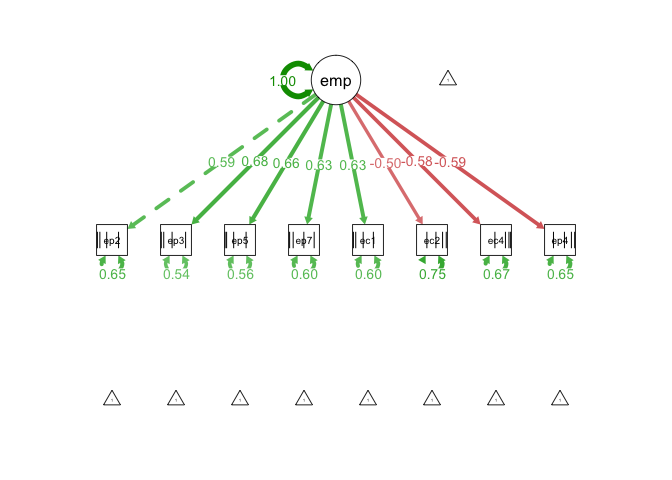
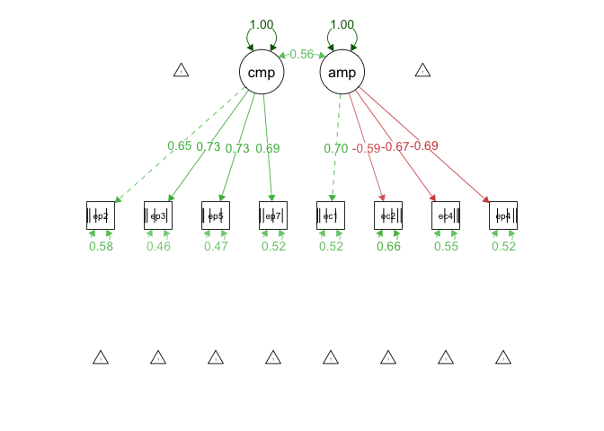

Structural Equation Modelling Using R
================
Todd K. Hartman
2017-02-17

Empathy Indicators

``` r
## Davis (1980, 1983) Interpersonal Reactivity Index
## 4 Sub-scales: Perspective-Taking; Empathic Concern; Personal Distress; Fantasy
## Response options 1 - 5, where 5 = "Describes me very well"
## [ept2] W22Q1_5. I try to look at everybody's side of a disagreement before I make a decision.
## [ept3] W22Q1_8. I sometimes try to understand my friends better by imagining how things look from their perspective.
## [ept5] W22Q1_16. I believe that there are two sides to every question and try to look at them both.
## [ept7] W22Q1_21. Before criticizing somebody, I try to imagine how I would feel if I were in their place.
## [ec1] W22Q1_1. I often have tender, concerned feelings for people less fortunate than me.
## [ec2] W22Q1_3. Sometimes I don't feel very sorry for other people when they are having problems. (R)
## [ec4] W22Q1_10. Other people's misfortunes do not usually disturb me a great deal. (R)
## [epd4] W22Q1_12. Being in a tense emotional situation scares me.
```

Housekeeping

``` r
## Install and load necessary packages using 'pacman'
# install.packages('pacman')  # First installation only (uncomment and run if needed)
pacman::p_load(haven, lavaan)  # haven loads foreign datasets; lavaan is for SEM

## Check and set your working directory (Uncomment for your type of computer OS)
getwd()  # Get the current working directory
```

    ## [1] "/R"

``` r
# setwd("C:/ENTER/YOUR/FOLDER/PATH/HERE")  # For PC (Note the forward slashes!)
# setwd("~/ENTER/YOUR/FOLDER/PATH/HERE")  # For Mac OSX 
```

Load the ANES Panel Dataset (from Stata; use 'read\_spss' for SPSS)

``` r
anes <- read_dta("anes.dta")
head(anes)  # Check the first rows of the data
```

    ## # A tibble: 6 × 51
    ##    ept1  ept2  ept3  ept4  ept5  ept6  ept7   ec1   ec2   ec3   ec4   ec5
    ##   <dbl> <dbl> <dbl> <dbl> <dbl> <dbl> <dbl> <dbl> <dbl> <dbl> <dbl> <dbl>
    ## 1     2     3     3     2     3     3     3     4     3     4     2     4
    ## 2     2     3     4     2     3     2     2     5     2     5     2     4
    ## 3     1     3     3     3     5     3     3     5     1     1     1     5
    ## 4     2     4     3     2     2     3     3     4     2     4     4     2
    ## 5     1     4     4     1     3     3     3     5     1     5     1     3
    ## 6     4     5     3     3     5     3     4     3     3     5     2     4
    ## # ... with 39 more variables: ec6 <dbl>, epd1 <dbl>, epd2 <dbl>,
    ## #   epd3 <dbl>, epd4 <dbl>, epd5 <dbl>, epd6 <dbl>, epd7 <dbl>,
    ## #   epd8 <dbl>, hu1 <dbl>, hu2 <dbl>, hu3 <dbl>, hu4 <dbl>, hu5 <dbl>,
    ## #   hu6 <dbl>, hu7 <dbl>, hu8 <dbl>, rwa1 <dbl>, rwa2 <dbl>, rwa3 <dbl>,
    ## #   rwa4 <dbl>, ideology <dbl>, party <dbl>, male <dbl>, age <dbl>,
    ## #   hispanic <dbl>, nonwhite <dbl>, education <dbl>, income <dbl>,
    ## #   northeast <dbl>, midwest <dbl>, west <dbl>, south <dbl>,
    ## #   school15 <dbl>, ss15 <dbl>, poor15 <dbl>, war15 <dbl>, crime15 <dbl>,
    ## #   job15 <dbl>

CFA for Empathy (Note the single quote marks!)

``` r
## 1-Factor Model of empathy forcing cognitive and affective items 
## to load onto a single latent construct
cfa1 <- ' empathy =~ ept2 + ept3 + ept5 + ept7 + ec1 + ec2 + ec4 + epd4 '
model.cfa1 <- cfa(cfa1,                  # Use the 'cfa()' wrapper for the 'cfa1' model
           data=anes,                  # Specify the dataset
           ordered=c("ept2","ept3",    # Use this for ordinal indicators
                     "ept5","ept7",
                     "ec1", "ec2",
                     "ec4", "epd4"))
summary(model.cfa1)  # Display the CFA results
```

    ## lavaan (0.5-22) converged normally after  17 iterations
    ## 
    ##                                                   Used       Total
    ##   Number of observations                          2241        2320
    ## 
    ##   Estimator                                       DWLS      Robust
    ##   Minimum Function Test Statistic             1154.233    1576.153
    ##   Degrees of freedom                                20          20
    ##   P-value (Chi-square)                           0.000       0.000
    ##   Scaling correction factor                                  0.734
    ##   Shift parameter                                            3.638
    ##     for simple second-order correction (Mplus variant)
    ## 
    ## Parameter Estimates:
    ## 
    ##   Information                                 Expected
    ##   Standard Errors                           Robust.sem
    ## 
    ## Latent Variables:
    ##                    Estimate  Std.Err  z-value  P(>|z|)
    ##   empathy =~                                          
    ##     ept2              1.000                           
    ##     ept3              1.141    0.034   33.723    0.000
    ##     ept5              1.122    0.035   32.467    0.000
    ##     ept7              1.065    0.034   31.693    0.000
    ##     ec1               1.064    0.035   30.104    0.000
    ##     ec2              -0.843    0.036  -23.383    0.000
    ##     ec4              -0.977    0.037  -26.211    0.000
    ##     epd4             -0.992    0.037  -26.827    0.000
    ## 
    ## Intercepts:
    ##                    Estimate  Std.Err  z-value  P(>|z|)
    ##    .ept2              0.000                           
    ##    .ept3              0.000                           
    ##    .ept5              0.000                           
    ##    .ept7              0.000                           
    ##    .ec1               0.000                           
    ##    .ec2               0.000                           
    ##    .ec4               0.000                           
    ##    .epd4              0.000                           
    ##     empathy           0.000                           
    ## 
    ## Thresholds:
    ##                    Estimate  Std.Err  z-value  P(>|z|)
    ##     ept2|t1          -1.930    0.055  -35.034    0.000
    ##     ept2|t2          -1.242    0.035  -35.066    0.000
    ##     ept2|t3          -0.444    0.027  -16.183    0.000
    ##     ept2|t4           0.558    0.028   19.918    0.000
    ##     ept3|t1          -1.992    0.058  -34.372    0.000
    ##     ept3|t2          -1.264    0.036  -35.306    0.000
    ##     ept3|t3          -0.323    0.027  -11.954    0.000
    ##     ept3|t4           0.881    0.031   28.809    0.000
    ##     ept5|t1          -2.132    0.065  -32.558    0.000
    ##     ept5|t2          -1.502    0.041  -36.831    0.000
    ##     ept5|t3          -0.539    0.028  -19.299    0.000
    ##     ept5|t4           0.516    0.028   18.553    0.000
    ##     ept7|t1          -1.820    0.051  -35.996    0.000
    ##     ept7|t2          -1.039    0.032  -32.070    0.000
    ##     ept7|t3          -0.013    0.026   -0.486    0.627
    ##     ept7|t4           0.951    0.031   30.348    0.000
    ##     ec1|t1           -1.916    0.054  -35.175    0.000
    ##     ec1|t2           -1.264    0.036  -35.306    0.000
    ##     ec1|t3           -0.401    0.027  -14.721    0.000
    ##     ec1|t4            0.450    0.027   16.391    0.000
    ##     ec2|t1           -0.428    0.027  -15.640    0.000
    ##     ec2|t2            0.325    0.027   12.038    0.000
    ##     ec2|t3            1.005    0.032   31.436    0.000
    ##     ec2|t4            1.765    0.049   36.360    0.000
    ##     ec4|t1           -0.089    0.027   -3.358    0.001
    ##     ec4|t2            0.861    0.030   28.350    0.000
    ##     ec4|t3            1.403    0.039   36.429    0.000
    ##     ec4|t4            1.938    0.055   34.960    0.000
    ##     epd4|t1          -0.557    0.028  -19.877    0.000
    ##     epd4|t2           0.369    0.027   13.590    0.000
    ##     epd4|t3           1.123    0.034   33.480    0.000
    ##     epd4|t4           1.960    0.056   34.723    0.000
    ## 
    ## Variances:
    ##                    Estimate  Std.Err  z-value  P(>|z|)
    ##    .ept2              0.649                           
    ##    .ept3              0.543                           
    ##    .ept5              0.559                           
    ##    .ept7              0.602                           
    ##    .ec1               0.603                           
    ##    .ec2               0.751                           
    ##    .ec4               0.665                           
    ##    .epd4              0.655                           
    ##     empathy           0.351    0.018   19.292    0.000
    ## 
    ## Scales y*:
    ##                    Estimate  Std.Err  z-value  P(>|z|)
    ##     ept2              1.000                           
    ##     ept3              1.000                           
    ##     ept5              1.000                           
    ##     ept7              1.000                           
    ##     ec1               1.000                           
    ##     ec2               1.000                           
    ##     ec4               1.000                           
    ##     epd4              1.000

``` r
standardizedSolution(model.cfa1)  # Print standardized estimates
```

    ##        lhs  op     rhs est.std    se       z pvalue
    ## 1  empathy  =~    ept2   0.592 0.015  38.584  0.000
    ## 2  empathy  =~    ept3   0.676 0.013  51.656  0.000
    ## 3  empathy  =~    ept5   0.664 0.014  49.009  0.000
    ## 4  empathy  =~    ept7   0.631 0.014  46.143  0.000
    ## 5  empathy  =~     ec1   0.630 0.014  44.550  0.000
    ## 6  empathy  =~     ec2  -0.499 0.016 -30.391  0.000
    ## 7  empathy  =~     ec4  -0.579 0.015 -37.551  0.000
    ## 8  empathy  =~    epd4  -0.587 0.015 -38.841  0.000
    ## 9     ept2   |      t1  -1.930 0.055 -35.034  0.000
    ## 10    ept2   |      t2  -1.242 0.035 -35.066  0.000
    ## 11    ept2   |      t3  -0.444 0.027 -16.183  0.000
    ## 12    ept2   |      t4   0.558 0.028  19.918  0.000
    ## 13    ept3   |      t1  -1.992 0.058 -34.372  0.000
    ## 14    ept3   |      t2  -1.264 0.036 -35.306  0.000
    ## 15    ept3   |      t3  -0.323 0.027 -11.954  0.000
    ## 16    ept3   |      t4   0.881 0.031  28.809  0.000
    ## 17    ept5   |      t1  -2.132 0.065 -32.558  0.000
    ## 18    ept5   |      t2  -1.502 0.041 -36.831  0.000
    ## 19    ept5   |      t3  -0.539 0.028 -19.299  0.000
    ## 20    ept5   |      t4   0.516 0.028  18.553  0.000
    ## 21    ept7   |      t1  -1.820 0.051 -35.996  0.000
    ## 22    ept7   |      t2  -1.039 0.032 -32.070  0.000
    ## 23    ept7   |      t3  -0.013 0.026  -0.486  0.627
    ## 24    ept7   |      t4   0.951 0.031  30.348  0.000
    ## 25     ec1   |      t1  -1.916 0.054 -35.175  0.000
    ## 26     ec1   |      t2  -1.264 0.036 -35.306  0.000
    ## 27     ec1   |      t3  -0.401 0.027 -14.721  0.000
    ## 28     ec1   |      t4   0.450 0.027  16.391  0.000
    ## 29     ec2   |      t1  -0.428 0.027 -15.640  0.000
    ## 30     ec2   |      t2   0.325 0.027  12.038  0.000
    ## 31     ec2   |      t3   1.005 0.032  31.436  0.000
    ## 32     ec2   |      t4   1.765 0.049  36.360  0.000
    ## 33     ec4   |      t1  -0.089 0.027  -3.358  0.001
    ## 34     ec4   |      t2   0.861 0.030  28.350  0.000
    ## 35     ec4   |      t3   1.403 0.039  36.429  0.000
    ## 36     ec4   |      t4   1.938 0.055  34.960  0.000
    ## 37    epd4   |      t1  -0.557 0.028 -19.877  0.000
    ## 38    epd4   |      t2   0.369 0.027  13.590  0.000
    ## 39    epd4   |      t3   1.123 0.034  33.480  0.000
    ## 40    epd4   |      t4   1.960 0.056  34.723  0.000
    ## 41    ept2  ~~    ept2   0.649 0.000      NA     NA
    ## 42    ept3  ~~    ept3   0.543 0.000      NA     NA
    ## 43    ept5  ~~    ept5   0.559 0.000      NA     NA
    ## 44    ept7  ~~    ept7   0.602 0.000      NA     NA
    ## 45     ec1  ~~     ec1   0.603 0.000      NA     NA
    ## 46     ec2  ~~     ec2   0.751 0.000      NA     NA
    ## 47     ec4  ~~     ec4   0.665 0.000      NA     NA
    ## 48    epd4  ~~    epd4   0.655 0.000      NA     NA
    ## 49 empathy  ~~ empathy   1.000 0.000      NA     NA
    ## 50    ept2 ~*~    ept2   1.000 0.000      NA     NA
    ## 51    ept3 ~*~    ept3   1.000 0.000      NA     NA
    ## 52    ept5 ~*~    ept5   1.000 0.000      NA     NA
    ## 53    ept7 ~*~    ept7   1.000 0.000      NA     NA
    ## 54     ec1 ~*~     ec1   1.000 0.000      NA     NA
    ## 55     ec2 ~*~     ec2   1.000 0.000      NA     NA
    ## 56     ec4 ~*~     ec4   1.000 0.000      NA     NA
    ## 57    epd4 ~*~    epd4   1.000 0.000      NA     NA
    ## 58    ept2  ~1           0.000 0.000      NA     NA
    ## 59    ept3  ~1           0.000 0.000      NA     NA
    ## 60    ept5  ~1           0.000 0.000      NA     NA
    ## 61    ept7  ~1           0.000 0.000      NA     NA
    ## 62     ec1  ~1           0.000 0.000      NA     NA
    ## 63     ec2  ~1           0.000 0.000      NA     NA
    ## 64     ec4  ~1           0.000 0.000      NA     NA
    ## 65    epd4  ~1           0.000 0.000      NA     NA
    ## 66 empathy  ~1           0.000 0.000      NA     NA

``` r
fitMeasures(model.cfa1)  # Model fit statistics (e.g., RMSEA, CFI, TLI)
```

    ##                          npar                          fmin 
    ##                        40.000                         0.258 
    ##                         chisq                            df 
    ##                      1154.233                        20.000 
    ##                        pvalue                  chisq.scaled 
    ##                         0.000                      1576.153 
    ##                     df.scaled                 pvalue.scaled 
    ##                        20.000                         0.000 
    ##          chisq.scaling.factor                baseline.chisq 
    ##                         0.734                     14057.136 
    ##                   baseline.df               baseline.pvalue 
    ##                        28.000                         0.000 
    ##         baseline.chisq.scaled            baseline.df.scaled 
    ##                      9516.127                        28.000 
    ##        baseline.pvalue.scaled baseline.chisq.scaling.factor 
    ##                         0.000                         1.479 
    ##                           cfi                           tli 
    ##                         0.919                         0.887 
    ##                          nnfi                           rfi 
    ##                         0.887                         0.885 
    ##                           nfi                          pnfi 
    ##                         0.918                         0.656 
    ##                           ifi                           rni 
    ##                         0.919                         0.919 
    ##                    cfi.scaled                    tli.scaled 
    ##                         0.836                         0.770 
    ##                    cfi.robust                    tli.robust 
    ##                            NA                            NA 
    ##                   nnfi.scaled                   nnfi.robust 
    ##                         0.770                            NA 
    ##                    rfi.scaled                    nfi.scaled 
    ##                         0.768                         0.834 
    ##                    ifi.scaled                    rni.scaled 
    ##                         0.834                         0.889 
    ##                    rni.robust                         rmsea 
    ##                            NA                         0.159 
    ##                rmsea.ci.lower                rmsea.ci.upper 
    ##                         0.151                         0.167 
    ##                  rmsea.pvalue                  rmsea.scaled 
    ##                         0.000                         0.186 
    ##         rmsea.ci.lower.scaled         rmsea.ci.upper.scaled 
    ##                         0.179                         0.194 
    ##           rmsea.pvalue.scaled                  rmsea.robust 
    ##                         0.000                            NA 
    ##         rmsea.ci.lower.robust         rmsea.ci.upper.robust 
    ##                            NA                            NA 
    ##           rmsea.pvalue.robust                           rmr 
    ##                            NA                         0.092 
    ##                    rmr_nomean                          srmr 
    ##                         0.102                         0.102 
    ##                  srmr_bentler           srmr_bentler_nomean 
    ##                         0.092                         0.102 
    ##                   srmr_bollen            srmr_bollen_nomean 
    ##                         0.092                         0.102 
    ##                    srmr_mplus             srmr_mplus_nomean 
    ##                         0.092                         0.102 
    ##                         cn_05                         cn_01 
    ##                        61.958                        73.904 
    ##                           gfi                          agfi 
    ##                         0.970                         0.911 
    ##                          pgfi                           mfi 
    ##                         0.323                         0.776

``` r
semPaths(model.cfa1, "std", edge.label.cex = 1, curvePivot = FALSE)  # Make figure of std. results
```



``` r
## 2-Factor Model of empathy
cfa2 <- ' cempathy =~ ept2 + ept3 + ept5 + ept7
          aempathy =~ ec1 + ec2 + ec4 + epd4
        '
model.cfa2 <- cfa(cfa2,
                data=anes, 
                ordered=c("ept2","ept3",
                          "ept5","ept7",
                          "ec1", "ec2",
                          "ec4", "epd4"))
summary(model.cfa2)
```

    ## lavaan (0.5-22) converged normally after  18 iterations
    ## 
    ##                                                   Used       Total
    ##   Number of observations                          2241        2320
    ## 
    ##   Estimator                                       DWLS      Robust
    ##   Minimum Function Test Statistic              214.585     314.052
    ##   Degrees of freedom                                19          19
    ##   P-value (Chi-square)                           0.000       0.000
    ##   Scaling correction factor                                  0.689
    ##   Shift parameter                                            2.636
    ##     for simple second-order correction (Mplus variant)
    ## 
    ## Parameter Estimates:
    ## 
    ##   Information                                 Expected
    ##   Standard Errors                           Robust.sem
    ## 
    ## Latent Variables:
    ##                    Estimate  Std.Err  z-value  P(>|z|)
    ##   cempathy =~                                         
    ##     ept2              1.000                           
    ##     ept3              1.135    0.032   35.461    0.000
    ##     ept5              1.123    0.033   34.457    0.000
    ##     ept7              1.067    0.031   34.263    0.000
    ##   aempathy =~                                         
    ##     ec1               1.000                           
    ##     ec2              -0.841    0.030  -28.214    0.000
    ##     ec4              -0.964    0.030  -31.641    0.000
    ##     epd4             -0.992    0.032  -31.368    0.000
    ## 
    ## Covariances:
    ##                    Estimate  Std.Err  z-value  P(>|z|)
    ##   cempathy ~~                                         
    ##     aempathy          0.252    0.012   20.865    0.000
    ## 
    ## Intercepts:
    ##                    Estimate  Std.Err  z-value  P(>|z|)
    ##    .ept2              0.000                           
    ##    .ept3              0.000                           
    ##    .ept5              0.000                           
    ##    .ept7              0.000                           
    ##    .ec1               0.000                           
    ##    .ec2               0.000                           
    ##    .ec4               0.000                           
    ##    .epd4              0.000                           
    ##     cempathy          0.000                           
    ##     aempathy          0.000                           
    ## 
    ## Thresholds:
    ##                    Estimate  Std.Err  z-value  P(>|z|)
    ##     ept2|t1          -1.930    0.055  -35.034    0.000
    ##     ept2|t2          -1.242    0.035  -35.066    0.000
    ##     ept2|t3          -0.444    0.027  -16.183    0.000
    ##     ept2|t4           0.558    0.028   19.918    0.000
    ##     ept3|t1          -1.992    0.058  -34.372    0.000
    ##     ept3|t2          -1.264    0.036  -35.306    0.000
    ##     ept3|t3          -0.323    0.027  -11.954    0.000
    ##     ept3|t4           0.881    0.031   28.809    0.000
    ##     ept5|t1          -2.132    0.065  -32.558    0.000
    ##     ept5|t2          -1.502    0.041  -36.831    0.000
    ##     ept5|t3          -0.539    0.028  -19.299    0.000
    ##     ept5|t4           0.516    0.028   18.553    0.000
    ##     ept7|t1          -1.820    0.051  -35.996    0.000
    ##     ept7|t2          -1.039    0.032  -32.070    0.000
    ##     ept7|t3          -0.013    0.026   -0.486    0.627
    ##     ept7|t4           0.951    0.031   30.348    0.000
    ##     ec1|t1           -1.916    0.054  -35.175    0.000
    ##     ec1|t2           -1.264    0.036  -35.306    0.000
    ##     ec1|t3           -0.401    0.027  -14.721    0.000
    ##     ec1|t4            0.450    0.027   16.391    0.000
    ##     ec2|t1           -0.428    0.027  -15.640    0.000
    ##     ec2|t2            0.325    0.027   12.038    0.000
    ##     ec2|t3            1.005    0.032   31.436    0.000
    ##     ec2|t4            1.765    0.049   36.360    0.000
    ##     ec4|t1           -0.089    0.027   -3.358    0.001
    ##     ec4|t2            0.861    0.030   28.350    0.000
    ##     ec4|t3            1.403    0.039   36.429    0.000
    ##     ec4|t4            1.938    0.055   34.960    0.000
    ##     epd4|t1          -0.557    0.028  -19.877    0.000
    ##     epd4|t2           0.369    0.027   13.590    0.000
    ##     epd4|t3           1.123    0.034   33.480    0.000
    ##     epd4|t4           1.960    0.056   34.723    0.000
    ## 
    ## Variances:
    ##                    Estimate  Std.Err  z-value  P(>|z|)
    ##    .ept2              0.582                           
    ##    .ept3              0.462                           
    ##    .ept5              0.474                           
    ##    .ept7              0.525                           
    ##    .ec1               0.516                           
    ##    .ec2               0.657                           
    ##    .ec4               0.550                           
    ##    .epd4              0.524                           
    ##     cempathy          0.418    0.020   21.412    0.000
    ##     aempathy          0.484    0.020   23.733    0.000
    ## 
    ## Scales y*:
    ##                    Estimate  Std.Err  z-value  P(>|z|)
    ##     ept2              1.000                           
    ##     ept3              1.000                           
    ##     ept5              1.000                           
    ##     ept7              1.000                           
    ##     ec1               1.000                           
    ##     ec2               1.000                           
    ##     ec4               1.000                           
    ##     epd4              1.000

``` r
standardizedSolution(model.cfa2)
```

    ##         lhs  op      rhs est.std    se       z pvalue
    ## 1  cempathy  =~     ept2   0.646 0.015  42.823  0.000
    ## 2  cempathy  =~     ept3   0.733 0.013  55.594  0.000
    ## 3  cempathy  =~     ept5   0.725 0.013  54.284  0.000
    ## 4  cempathy  =~     ept7   0.689 0.014  50.914  0.000
    ## 5  aempathy  =~      ec1   0.696 0.015  47.466  0.000
    ## 6  aempathy  =~      ec2  -0.585 0.017 -35.217  0.000
    ## 7  aempathy  =~      ec4  -0.671 0.016 -42.671  0.000
    ## 8  aempathy  =~     epd4  -0.690 0.015 -44.624  0.000
    ## 9      ept2   |       t1  -1.930 0.055 -35.034  0.000
    ## 10     ept2   |       t2  -1.242 0.035 -35.066  0.000
    ## 11     ept2   |       t3  -0.444 0.027 -16.183  0.000
    ## 12     ept2   |       t4   0.558 0.028  19.918  0.000
    ## 13     ept3   |       t1  -1.992 0.058 -34.372  0.000
    ## 14     ept3   |       t2  -1.264 0.036 -35.306  0.000
    ## 15     ept3   |       t3  -0.323 0.027 -11.954  0.000
    ## 16     ept3   |       t4   0.881 0.031  28.809  0.000
    ## 17     ept5   |       t1  -2.132 0.065 -32.558  0.000
    ## 18     ept5   |       t2  -1.502 0.041 -36.831  0.000
    ## 19     ept5   |       t3  -0.539 0.028 -19.299  0.000
    ## 20     ept5   |       t4   0.516 0.028  18.553  0.000
    ## 21     ept7   |       t1  -1.820 0.051 -35.996  0.000
    ## 22     ept7   |       t2  -1.039 0.032 -32.070  0.000
    ## 23     ept7   |       t3  -0.013 0.026  -0.486  0.627
    ## 24     ept7   |       t4   0.951 0.031  30.348  0.000
    ## 25      ec1   |       t1  -1.916 0.054 -35.175  0.000
    ## 26      ec1   |       t2  -1.264 0.036 -35.306  0.000
    ## 27      ec1   |       t3  -0.401 0.027 -14.721  0.000
    ## 28      ec1   |       t4   0.450 0.027  16.391  0.000
    ## 29      ec2   |       t1  -0.428 0.027 -15.640  0.000
    ## 30      ec2   |       t2   0.325 0.027  12.038  0.000
    ## 31      ec2   |       t3   1.005 0.032  31.436  0.000
    ## 32      ec2   |       t4   1.765 0.049  36.360  0.000
    ## 33      ec4   |       t1  -0.089 0.027  -3.358  0.001
    ## 34      ec4   |       t2   0.861 0.030  28.350  0.000
    ## 35      ec4   |       t3   1.403 0.039  36.429  0.000
    ## 36      ec4   |       t4   1.938 0.055  34.960  0.000
    ## 37     epd4   |       t1  -0.557 0.028 -19.877  0.000
    ## 38     epd4   |       t2   0.369 0.027  13.590  0.000
    ## 39     epd4   |       t3   1.123 0.034  33.480  0.000
    ## 40     epd4   |       t4   1.960 0.056  34.723  0.000
    ## 41     ept2  ~~     ept2   0.582 0.000      NA     NA
    ## 42     ept3  ~~     ept3   0.462 0.000      NA     NA
    ## 43     ept5  ~~     ept5   0.474 0.000      NA     NA
    ## 44     ept7  ~~     ept7   0.525 0.000      NA     NA
    ## 45      ec1  ~~      ec1   0.516 0.000      NA     NA
    ## 46      ec2  ~~      ec2   0.657 0.000      NA     NA
    ## 47      ec4  ~~      ec4   0.550 0.000      NA     NA
    ## 48     epd4  ~~     epd4   0.524 0.000      NA     NA
    ## 49 cempathy  ~~ cempathy   1.000 0.000      NA     NA
    ## 50 aempathy  ~~ aempathy   1.000 0.000      NA     NA
    ## 51 cempathy  ~~ aempathy   0.560 0.019  30.009  0.000
    ## 52     ept2 ~*~     ept2   1.000 0.000      NA     NA
    ## 53     ept3 ~*~     ept3   1.000 0.000      NA     NA
    ## 54     ept5 ~*~     ept5   1.000 0.000      NA     NA
    ## 55     ept7 ~*~     ept7   1.000 0.000      NA     NA
    ## 56      ec1 ~*~      ec1   1.000 0.000      NA     NA
    ## 57      ec2 ~*~      ec2   1.000 0.000      NA     NA
    ## 58      ec4 ~*~      ec4   1.000 0.000      NA     NA
    ## 59     epd4 ~*~     epd4   1.000 0.000      NA     NA
    ## 60     ept2  ~1            0.000 0.000      NA     NA
    ## 61     ept3  ~1            0.000 0.000      NA     NA
    ## 62     ept5  ~1            0.000 0.000      NA     NA
    ## 63     ept7  ~1            0.000 0.000      NA     NA
    ## 64      ec1  ~1            0.000 0.000      NA     NA
    ## 65      ec2  ~1            0.000 0.000      NA     NA
    ## 66      ec4  ~1            0.000 0.000      NA     NA
    ## 67     epd4  ~1            0.000 0.000      NA     NA
    ## 68 cempathy  ~1            0.000 0.000      NA     NA
    ## 69 aempathy  ~1            0.000 0.000      NA     NA

``` r
fitMeasures(model.cfa2)  # The 2-factor CFA fits the data better
```

    ##                          npar                          fmin 
    ##                        41.000                         0.048 
    ##                         chisq                            df 
    ##                       214.585                        19.000 
    ##                        pvalue                  chisq.scaled 
    ##                         0.000                       314.052 
    ##                     df.scaled                 pvalue.scaled 
    ##                        19.000                         0.000 
    ##          chisq.scaling.factor                baseline.chisq 
    ##                         0.689                     14057.136 
    ##                   baseline.df               baseline.pvalue 
    ##                        28.000                         0.000 
    ##         baseline.chisq.scaled            baseline.df.scaled 
    ##                      9516.127                        28.000 
    ##        baseline.pvalue.scaled baseline.chisq.scaling.factor 
    ##                         0.000                         1.479 
    ##                           cfi                           tli 
    ##                         0.986                         0.979 
    ##                          nnfi                           rfi 
    ##                         0.979                         0.978 
    ##                           nfi                          pnfi 
    ##                         0.985                         0.668 
    ##                           ifi                           rni 
    ##                         0.986                         0.986 
    ##                    cfi.scaled                    tli.scaled 
    ##                         0.969                         0.954 
    ##                    cfi.robust                    tli.robust 
    ##                            NA                            NA 
    ##                   nnfi.scaled                   nnfi.robust 
    ##                         0.954                            NA 
    ##                    rfi.scaled                    nfi.scaled 
    ##                         0.951                         0.967 
    ##                    ifi.scaled                    rni.scaled 
    ##                         0.967                         0.979 
    ##                    rni.robust                         rmsea 
    ##                            NA                         0.068 
    ##                rmsea.ci.lower                rmsea.ci.upper 
    ##                         0.060                         0.076 
    ##                  rmsea.pvalue                  rmsea.scaled 
    ##                         0.000                         0.083 
    ##         rmsea.ci.lower.scaled         rmsea.ci.upper.scaled 
    ##                         0.075                         0.091 
    ##           rmsea.pvalue.scaled                  rmsea.robust 
    ##                         0.000                            NA 
    ##         rmsea.ci.lower.robust         rmsea.ci.upper.robust 
    ##                            NA                            NA 
    ##           rmsea.pvalue.robust                           rmr 
    ##                            NA                         0.040 
    ##                    rmr_nomean                          srmr 
    ##                         0.044                         0.044 
    ##                  srmr_bentler           srmr_bentler_nomean 
    ##                         0.040                         0.044 
    ##                   srmr_bollen            srmr_bollen_nomean 
    ##                         0.040                         0.044 
    ##                    srmr_mplus             srmr_mplus_nomean 
    ##                         0.040                         0.044 
    ##                         cn_05                         cn_01 
    ##                       315.661                       378.788 
    ##                           gfi                          agfi 
    ##                         0.994                         0.983 
    ##                          pgfi                           mfi 
    ##                         0.315                         0.957

``` r
semPaths(model.cfa2, "std", edge.label.cex = 1, curvePivot = FALSE)  # Make figure of std. results
```



``` r
## Full SEM for Empathy, Humanitarianism, and Social Spending
sem1 <- '  # Measurement component
            cempathy =~ ept2 + ept3 + ept5 + ept7
            aempathy =~ ec1 + ec2 + ec4 + epd4
            human =~ hu1 + hu2 + hu3 + hu4 + hu5 + hu6 + hu7 + hu8
            social =~ school15 + ss15 + poor15 + job15
            
            # Structural component (regressions)
            aempathy ~ a*cempathy
            human ~ b*aempathy
            social ~ c*human
            social ~ ideology + party + male + age + hispanic + 
                        nonwhite + education + income + south

            # Indirect Effects 
            ab := a*b
            bc := b*c
            abc := a*b*c         

        '
model.sem1 <- sem(sem1,
           data=anes, 
           ordered=c("ept2","ept3",
                     "ept5","ept7",
                     "ec1", "ec2",
                     "ec4", "epd4",
                     "hu1","hu2",
                     "hu3","hu4",
                     "hu5","hu6",
                     "hu7","hu8"))
summary(model.sem1, standardized = TRUE)
```

    ## lavaan (0.5-22) converged normally after  75 iterations
    ## 
    ##                                                   Used       Total
    ##   Number of observations                          1056        2320
    ## 
    ##   Estimator                                       DWLS      Robust
    ##   Minimum Function Test Statistic             1267.863    1040.184
    ##   Degrees of freedom                               338         338
    ##   P-value (Chi-square)                           0.000       0.000
    ##   Scaling correction factor                                  1.434
    ##   Shift parameter                                          155.958
    ##     for simple second-order correction (Mplus variant)
    ## 
    ## Parameter Estimates:
    ## 
    ##   Information                                 Expected
    ##   Standard Errors                           Robust.sem
    ## 
    ## Latent Variables:
    ##                    Estimate  Std.Err  z-value  P(>|z|)   Std.lv  Std.all
    ##   cempathy =~                                                           
    ##     ept2              1.000                               0.661    0.661
    ##     ept3              1.060    0.049   21.830    0.000    0.701    0.701
    ##     ept5              1.083    0.051   21.168    0.000    0.716    0.716
    ##     ept7              1.098    0.050   21.771    0.000    0.726    0.726
    ##   aempathy =~                                                           
    ##     ec1               1.000                               0.788    0.788
    ##     ec2              -0.627    0.037  -16.798    0.000   -0.494   -0.494
    ##     ec4              -0.735    0.034  -21.611    0.000   -0.579   -0.579
    ##     epd4             -0.791    0.034  -23.086    0.000   -0.623   -0.623
    ##   human =~                                                              
    ##     hu1               1.000                               0.885    0.885
    ##     hu2               0.935    0.015   62.529    0.000    0.827    0.827
    ##     hu3              -0.737    0.021  -34.982    0.000   -0.652   -0.652
    ##     hu4               0.908    0.017   54.861    0.000    0.804    0.804
    ##     hu5               0.962    0.015   65.790    0.000    0.852    0.852
    ##     hu6               0.861    0.016   54.142    0.000    0.762    0.762
    ##     hu7              -0.617    0.024  -26.075    0.000   -0.546   -0.546
    ##     hu8              -0.709    0.023  -30.871    0.000   -0.628   -0.628
    ##   social =~                                                             
    ##     school15          1.000                               0.159    0.626
    ##     ss15              0.772    0.073   10.617    0.000    0.123    0.557
    ##     poor15            1.470    0.128   11.494    0.000    0.233    0.894
    ##     job15             0.943    0.109    8.635    0.000    0.150    0.499
    ## 
    ## Regressions:
    ##                    Estimate  Std.Err  z-value  P(>|z|)   Std.lv  Std.all
    ##   aempathy ~                                                            
    ##     cempathy   (a)    0.741    0.043   17.179    0.000    0.622    0.622
    ##   human ~                                                               
    ##     aempathy   (b)    0.837    0.034   24.539    0.000    0.746    0.746
    ##   social ~                                                              
    ##     human      (c)    0.060    0.007    8.981    0.000    0.336    0.336
    ##     ideology         -0.144    0.023   -6.300    0.000   -0.909   -0.281
    ##     party            -0.134    0.020   -6.759    0.000   -0.847   -0.312
    ##     male             -0.030    0.010   -3.093    0.002   -0.191   -0.095
    ##     age               0.000    0.000    1.291    0.197    0.003    0.042
    ##     hispanic         -0.010    0.025   -0.406    0.684   -0.063   -0.014
    ##     nonwhite          0.019    0.015    1.282    0.200    0.119    0.043
    ##     education        -0.006    0.020   -0.306    0.760   -0.038   -0.010
    ##     income           -0.069    0.025   -2.741    0.006   -0.432   -0.092
    ##     south             0.009    0.010    0.923    0.356    0.058    0.027
    ## 
    ## Intercepts:
    ##                    Estimate  Std.Err  z-value  P(>|z|)   Std.lv  Std.all
    ##    .ept2              0.000                               0.000    0.000
    ##    .ept3              0.000                               0.000    0.000
    ##    .ept5              0.000                               0.000    0.000
    ##    .ept7              0.000                               0.000    0.000
    ##    .ec1               0.000                               0.000    0.000
    ##    .ec2               0.000                               0.000    0.000
    ##    .ec4               0.000                               0.000    0.000
    ##    .epd4              0.000                               0.000    0.000
    ##    .hu1               0.000                               0.000    0.000
    ##    .hu2               0.000                               0.000    0.000
    ##    .hu3               0.000                               0.000    0.000
    ##    .hu4               0.000                               0.000    0.000
    ##    .hu5               0.000                               0.000    0.000
    ##    .hu6               0.000                               0.000    0.000
    ##    .hu7               0.000                               0.000    0.000
    ##    .hu8               0.000                               0.000    0.000
    ##    .school15          0.920    0.041   22.393    0.000    0.920    3.627
    ##    .ss15              0.830    0.034   24.167    0.000    0.830    3.771
    ##    .poor15            0.792    0.038   20.635    0.000    0.792    3.035
    ##    .job15             0.746    0.051   14.607    0.000    0.746    2.490
    ##     cempathy          0.000                               0.000    0.000
    ##    .aempathy          0.000                               0.000    0.000
    ##    .human             0.000                               0.000    0.000
    ##    .social            0.000                               0.000    0.000
    ## 
    ## Thresholds:
    ##                    Estimate  Std.Err  z-value  P(>|z|)   Std.lv  Std.all
    ##     ept2|t1          -1.998    0.201   -9.927    0.000   -1.998   -1.998
    ##     ept2|t2          -1.349    0.187   -7.223    0.000   -1.349   -1.349
    ##     ept2|t3          -0.419    0.183   -2.290    0.022   -0.419   -0.419
    ##     ept2|t4           0.607    0.182    3.330    0.001    0.607    0.607
    ##     ept3|t1          -1.958    0.207   -9.451    0.000   -1.958   -1.958
    ##     ept3|t2          -1.259    0.194   -6.505    0.000   -1.259   -1.259
    ##     ept3|t3          -0.298    0.189   -1.582    0.114   -0.298   -0.298
    ##     ept3|t4           0.949    0.189    5.013    0.000    0.949    0.949
    ##     ept5|t1          -2.110    0.198  -10.656    0.000   -2.110   -2.110
    ##     ept5|t2          -1.397    0.174   -8.047    0.000   -1.397   -1.397
    ##     ept5|t3          -0.439    0.170   -2.579    0.010   -0.439   -0.439
    ##     ept5|t4           0.685    0.171    4.011    0.000    0.685    0.685
    ##     ept7|t1          -1.549    0.184   -8.418    0.000   -1.549   -1.549
    ##     ept7|t2          -0.718    0.172   -4.174    0.000   -0.718   -0.718
    ##     ept7|t3           0.306    0.170    1.798    0.072    0.306    0.306
    ##     ept7|t4           1.313    0.173    7.602    0.000    1.313    1.313
    ##     ec1|t1           -2.121    0.194  -10.945    0.000   -2.121   -2.121
    ##     ec1|t2           -1.430    0.190   -7.522    0.000   -1.430   -1.430
    ##     ec1|t3           -0.547    0.185   -2.962    0.003   -0.547   -0.547
    ##     ec1|t4            0.368    0.184    2.004    0.045    0.368    0.368
    ##     ec2|t1           -0.473    0.185   -2.557    0.011   -0.473   -0.473
    ##     ec2|t2            0.342    0.185    1.850    0.064    0.342    0.342
    ##     ec2|t3            1.033    0.188    5.490    0.000    1.033    1.033
    ##     ec2|t4            1.809    0.195    9.295    0.000    1.809    1.809
    ##     ec4|t1           -0.323    0.182   -1.777    0.076   -0.323   -0.323
    ##     ec4|t2            0.665    0.182    3.647    0.000    0.665    0.665
    ##     ec4|t3            1.217    0.189    6.436    0.000    1.217    1.217
    ##     ec4|t4            1.869    0.205    9.106    0.000    1.869    1.869
    ##     epd4|t1          -0.876    0.182   -4.829    0.000   -0.876   -0.876
    ##     epd4|t2           0.129    0.180    0.717    0.473    0.129    0.129
    ##     epd4|t3           0.909    0.183    4.975    0.000    0.909    0.909
    ##     epd4|t4           1.884    0.193    9.744    0.000    1.884    1.884
    ##     hu1|t1           -2.584    0.226  -11.438    0.000   -2.584   -2.584
    ##     hu1|t2           -2.125    0.202  -10.541    0.000   -2.125   -2.125
    ##     hu1|t3           -1.050    0.190   -5.538    0.000   -1.050   -1.050
    ##     hu1|t4            0.453    0.191    2.371    0.018    0.453    0.453
    ##     hu2|t1           -2.108    0.205  -10.259    0.000   -2.108   -2.108
    ##     hu2|t2           -1.300    0.188   -6.903    0.000   -1.300   -1.300
    ##     hu2|t3           -0.376    0.186   -2.020    0.043   -0.376   -0.376
    ##     hu2|t4            0.817    0.185    4.410    0.000    0.817    0.817
    ##     hu3|t1           -0.936    0.180   -5.200    0.000   -0.936   -0.936
    ##     hu3|t2            0.232    0.179    1.294    0.196    0.232    0.232
    ##     hu3|t3            0.975    0.182    5.357    0.000    0.975    0.975
    ##     hu3|t4            2.029    0.203   10.005    0.000    2.029    2.029
    ##     hu4|t1           -2.252    0.212  -10.603    0.000   -2.252   -2.252
    ##     hu4|t2           -1.713    0.198   -8.655    0.000   -1.713   -1.713
    ##     hu4|t3           -0.678    0.191   -3.545    0.000   -0.678   -0.678
    ##     hu4|t4            0.626    0.190    3.291    0.001    0.626    0.626
    ##     hu5|t1           -2.812    0.255  -11.016    0.000   -2.812   -2.812
    ##     hu5|t2           -2.027    0.209   -9.676    0.000   -2.027   -2.027
    ##     hu5|t3           -1.049    0.194   -5.398    0.000   -1.049   -1.049
    ##     hu5|t4            0.554    0.197    2.819    0.005    0.554    0.554
    ##     hu6|t1           -2.594    0.225  -11.537    0.000   -2.594   -2.594
    ##     hu6|t2           -1.678    0.190   -8.827    0.000   -1.678   -1.678
    ##     hu6|t3           -0.365    0.183   -1.995    0.046   -0.365   -0.365
    ##     hu6|t4            0.858    0.183    4.701    0.000    0.858    0.858
    ##     hu7|t1           -0.491    0.191   -2.571    0.010   -0.491   -0.491
    ##     hu7|t2            0.642    0.189    3.394    0.001    0.642    0.642
    ##     hu7|t3            1.448    0.195    7.416    0.000    1.448    1.448
    ##     hu7|t4            2.235    0.229    9.745    0.000    2.235    2.235
    ##     hu8|t1           -1.037    0.181   -5.744    0.000   -1.037   -1.037
    ##     hu8|t2            0.050    0.179    0.277    0.781    0.050    0.050
    ##     hu8|t3            0.953    0.182    5.250    0.000    0.953    0.953
    ##     hu8|t4            1.416    0.195    7.263    0.000    1.416    1.416
    ## 
    ## Variances:
    ##                    Estimate  Std.Err  z-value  P(>|z|)   Std.lv  Std.all
    ##    .ept2              0.563                               0.563    0.563
    ##    .ept3              0.509                               0.509    0.509
    ##    .ept5              0.488                               0.488    0.488
    ##    .ept7              0.473                               0.473    0.473
    ##    .ec1               0.379                               0.379    0.379
    ##    .ec2               0.756                               0.756    0.756
    ##    .ec4               0.664                               0.664    0.664
    ##    .epd4              0.612                               0.612    0.612
    ##    .hu1               0.217                               0.217    0.217
    ##    .hu2               0.315                               0.315    0.315
    ##    .hu3               0.575                               0.575    0.575
    ##    .hu4               0.354                               0.354    0.354
    ##    .hu5               0.275                               0.275    0.275
    ##    .hu6               0.419                               0.419    0.419
    ##    .hu7               0.702                               0.702    0.702
    ##    .hu8               0.606                               0.606    0.606
    ##    .school15          0.039    0.002   18.551    0.000    0.039    0.608
    ##    .ss15              0.033    0.002   20.231    0.000    0.033    0.689
    ##    .poor15            0.014    0.003    4.731    0.000    0.014    0.201
    ##    .job15             0.067    0.004   16.783    0.000    0.067    0.751
    ##     cempathy          0.437    0.030   14.516    0.000    1.000    1.000
    ##    .aempathy          0.381    0.029   13.332    0.000    0.614    0.614
    ##    .human             0.348    0.025   14.177    0.000    0.444    0.444
    ##    .social            0.014    0.002    7.574    0.000    0.551    0.551
    ## 
    ## Scales y*:
    ##                    Estimate  Std.Err  z-value  P(>|z|)   Std.lv  Std.all
    ##     ept2              1.000                               1.000    1.000
    ##     ept3              1.000                               1.000    1.000
    ##     ept5              1.000                               1.000    1.000
    ##     ept7              1.000                               1.000    1.000
    ##     ec1               1.000                               1.000    1.000
    ##     ec2               1.000                               1.000    1.000
    ##     ec4               1.000                               1.000    1.000
    ##     epd4              1.000                               1.000    1.000
    ##     hu1               1.000                               1.000    1.000
    ##     hu2               1.000                               1.000    1.000
    ##     hu3               1.000                               1.000    1.000
    ##     hu4               1.000                               1.000    1.000
    ##     hu5               1.000                               1.000    1.000
    ##     hu6               1.000                               1.000    1.000
    ##     hu7               1.000                               1.000    1.000
    ##     hu8               1.000                               1.000    1.000
    ## 
    ## Defined Parameters:
    ##                    Estimate  Std.Err  z-value  P(>|z|)   Std.lv  Std.all
    ##     ab                0.620    0.039   15.921    0.000    0.463    0.463
    ##     bc                0.050    0.006    8.267    0.000    0.250    0.250
    ##     abc               0.037    0.005    7.757    0.000    0.156    0.156

``` r
parameterEstimates(model.sem1)
```

    ##          lhs  op       rhs label    est    se       z pvalue ci.lower
    ## 1   cempathy  =~      ept2        1.000 0.000      NA     NA    1.000
    ## 2   cempathy  =~      ept3        1.060 0.049  21.830  0.000    0.965
    ## 3   cempathy  =~      ept5        1.083 0.051  21.168  0.000    0.983
    ## 4   cempathy  =~      ept7        1.098 0.050  21.771  0.000    1.000
    ## 5   aempathy  =~       ec1        1.000 0.000      NA     NA    1.000
    ## 6   aempathy  =~       ec2       -0.627 0.037 -16.798  0.000   -0.700
    ## 7   aempathy  =~       ec4       -0.735 0.034 -21.611  0.000   -0.802
    ## 8   aempathy  =~      epd4       -0.791 0.034 -23.086  0.000   -0.858
    ## 9      human  =~       hu1        1.000 0.000      NA     NA    1.000
    ## 10     human  =~       hu2        0.935 0.015  62.529  0.000    0.906
    ## 11     human  =~       hu3       -0.737 0.021 -34.982  0.000   -0.778
    ## 12     human  =~       hu4        0.908 0.017  54.861  0.000    0.876
    ## 13     human  =~       hu5        0.962 0.015  65.790  0.000    0.933
    ## 14     human  =~       hu6        0.861 0.016  54.142  0.000    0.830
    ## 15     human  =~       hu7       -0.617 0.024 -26.075  0.000   -0.663
    ## 16     human  =~       hu8       -0.709 0.023 -30.871  0.000   -0.754
    ## 17    social  =~  school15        1.000 0.000      NA     NA    1.000
    ## 18    social  =~      ss15        0.772 0.073  10.617  0.000    0.630
    ## 19    social  =~    poor15        1.470 0.128  11.494  0.000    1.220
    ## 20    social  =~     job15        0.943 0.109   8.635  0.000    0.729
    ## 21  aempathy   ~  cempathy     a  0.741 0.043  17.179  0.000    0.657
    ## 22     human   ~  aempathy     b  0.837 0.034  24.539  0.000    0.770
    ## 23    social   ~     human     c  0.060 0.007   8.981  0.000    0.047
    ## 24    social   ~  ideology       -0.144 0.023  -6.300  0.000   -0.189
    ## 25    social   ~     party       -0.134 0.020  -6.759  0.000   -0.173
    ## 26    social   ~      male       -0.030 0.010  -3.093  0.002   -0.050
    ## 27    social   ~       age        0.000 0.000   1.291  0.197    0.000
    ## 28    social   ~  hispanic       -0.010 0.025  -0.406  0.684   -0.059
    ## 29    social   ~  nonwhite        0.019 0.015   1.282  0.200   -0.010
    ## 30    social   ~ education       -0.006 0.020  -0.306  0.760   -0.044
    ## 31    social   ~    income       -0.069 0.025  -2.741  0.006   -0.118
    ## 32    social   ~     south        0.009 0.010   0.923  0.356   -0.010
    ## 33      ept2   |        t1       -1.998 0.201  -9.927  0.000   -2.393
    ## 34      ept2   |        t2       -1.349 0.187  -7.223  0.000   -1.715
    ## 35      ept2   |        t3       -0.419 0.183  -2.290  0.022   -0.777
    ## 36      ept2   |        t4        0.607 0.182   3.330  0.001    0.250
    ## 37      ept3   |        t1       -1.958 0.207  -9.451  0.000   -2.364
    ## 38      ept3   |        t2       -1.259 0.194  -6.505  0.000   -1.639
    ## 39      ept3   |        t3       -0.298 0.189  -1.582  0.114   -0.668
    ## 40      ept3   |        t4        0.949 0.189   5.013  0.000    0.578
    ## 41      ept5   |        t1       -2.110 0.198 -10.656  0.000   -2.498
    ## 42      ept5   |        t2       -1.397 0.174  -8.047  0.000   -1.737
    ## 43      ept5   |        t3       -0.439 0.170  -2.579  0.010   -0.773
    ## 44      ept5   |        t4        0.685 0.171   4.011  0.000    0.350
    ## 45      ept7   |        t1       -1.549 0.184  -8.418  0.000   -1.910
    ## 46      ept7   |        t2       -0.718 0.172  -4.174  0.000   -1.055
    ## 47      ept7   |        t3        0.306 0.170   1.798  0.072   -0.027
    ## 48      ept7   |        t4        1.313 0.173   7.602  0.000    0.975
    ## 49       ec1   |        t1       -2.121 0.194 -10.945  0.000   -2.501
    ## 50       ec1   |        t2       -1.430 0.190  -7.522  0.000   -1.803
    ## 51       ec1   |        t3       -0.547 0.185  -2.962  0.003   -0.910
    ## 52       ec1   |        t4        0.368 0.184   2.004  0.045    0.008
    ## 53       ec2   |        t1       -0.473 0.185  -2.557  0.011   -0.835
    ## 54       ec2   |        t2        0.342 0.185   1.850  0.064   -0.020
    ## 55       ec2   |        t3        1.033 0.188   5.490  0.000    0.664
    ## 56       ec2   |        t4        1.809 0.195   9.295  0.000    1.427
    ## 57       ec4   |        t1       -0.323 0.182  -1.777  0.076   -0.678
    ## 58       ec4   |        t2        0.665 0.182   3.647  0.000    0.308
    ## 59       ec4   |        t3        1.217 0.189   6.436  0.000    0.846
    ## 60       ec4   |        t4        1.869 0.205   9.106  0.000    1.466
    ## 61      epd4   |        t1       -0.876 0.182  -4.829  0.000   -1.232
    ## 62      epd4   |        t2        0.129 0.180   0.717  0.473   -0.224
    ## 63      epd4   |        t3        0.909 0.183   4.975  0.000    0.551
    ## 64      epd4   |        t4        1.884 0.193   9.744  0.000    1.505
    ## 65       hu1   |        t1       -2.584 0.226 -11.438  0.000   -3.027
    ## 66       hu1   |        t2       -2.125 0.202 -10.541  0.000   -2.520
    ## 67       hu1   |        t3       -1.050 0.190  -5.538  0.000   -1.422
    ## 68       hu1   |        t4        0.453 0.191   2.371  0.018    0.079
    ## 69       hu2   |        t1       -2.108 0.205 -10.259  0.000   -2.511
    ## 70       hu2   |        t2       -1.300 0.188  -6.903  0.000   -1.669
    ## 71       hu2   |        t3       -0.376 0.186  -2.020  0.043   -0.741
    ## 72       hu2   |        t4        0.817 0.185   4.410  0.000    0.454
    ## 73       hu3   |        t1       -0.936 0.180  -5.200  0.000   -1.289
    ## 74       hu3   |        t2        0.232 0.179   1.294  0.196   -0.119
    ## 75       hu3   |        t3        0.975 0.182   5.357  0.000    0.619
    ## 76       hu3   |        t4        2.029 0.203  10.005  0.000    1.631
    ## 77       hu4   |        t1       -2.252 0.212 -10.603  0.000   -2.668
    ## 78       hu4   |        t2       -1.713 0.198  -8.655  0.000   -2.101
    ## 79       hu4   |        t3       -0.678 0.191  -3.545  0.000   -1.053
    ## 80       hu4   |        t4        0.626 0.190   3.291  0.001    0.253
    ## 81       hu5   |        t1       -2.812 0.255 -11.016  0.000   -3.312
    ## 82       hu5   |        t2       -2.027 0.209  -9.676  0.000   -2.437
    ## 83       hu5   |        t3       -1.049 0.194  -5.398  0.000   -1.430
    ## 84       hu5   |        t4        0.554 0.197   2.819  0.005    0.169
    ## 85       hu6   |        t1       -2.594 0.225 -11.537  0.000   -3.035
    ## 86       hu6   |        t2       -1.678 0.190  -8.827  0.000   -2.051
    ## 87       hu6   |        t3       -0.365 0.183  -1.995  0.046   -0.723
    ## 88       hu6   |        t4        0.858 0.183   4.701  0.000    0.500
    ## 89       hu7   |        t1       -0.491 0.191  -2.571  0.010   -0.865
    ## 90       hu7   |        t2        0.642 0.189   3.394  0.001    0.271
    ## 91       hu7   |        t3        1.448 0.195   7.416  0.000    1.065
    ## 92       hu7   |        t4        2.235 0.229   9.745  0.000    1.786
    ## 93       hu8   |        t1       -1.037 0.181  -5.744  0.000   -1.391
    ## 94       hu8   |        t2        0.050 0.179   0.277  0.781   -0.301
    ## 95       hu8   |        t3        0.953 0.182   5.250  0.000    0.597
    ## 96       hu8   |        t4        1.416 0.195   7.263  0.000    1.034
    ## 97      ept2  ~~      ept2        0.563 0.000      NA     NA    0.563
    ## 98      ept3  ~~      ept3        0.509 0.000      NA     NA    0.509
    ## 99      ept5  ~~      ept5        0.488 0.000      NA     NA    0.488
    ## 100     ept7  ~~      ept7        0.473 0.000      NA     NA    0.473
    ## 101      ec1  ~~       ec1        0.379 0.000      NA     NA    0.379
    ## 102      ec2  ~~       ec2        0.756 0.000      NA     NA    0.756
    ## 103      ec4  ~~       ec4        0.664 0.000      NA     NA    0.664
    ## 104     epd4  ~~      epd4        0.612 0.000      NA     NA    0.612
    ## 105      hu1  ~~       hu1        0.217 0.000      NA     NA    0.217
    ## 106      hu2  ~~       hu2        0.315 0.000      NA     NA    0.315
    ## 107      hu3  ~~       hu3        0.575 0.000      NA     NA    0.575
    ## 108      hu4  ~~       hu4        0.354 0.000      NA     NA    0.354
    ## 109      hu5  ~~       hu5        0.275 0.000      NA     NA    0.275
    ## 110      hu6  ~~       hu6        0.419 0.000      NA     NA    0.419
    ## 111      hu7  ~~       hu7        0.702 0.000      NA     NA    0.702
    ## 112      hu8  ~~       hu8        0.606 0.000      NA     NA    0.606
    ## 113 school15  ~~  school15        0.039 0.002  18.551  0.000    0.035
    ## 114     ss15  ~~      ss15        0.033 0.002  20.231  0.000    0.030
    ## 115   poor15  ~~    poor15        0.014 0.003   4.731  0.000    0.008
    ## 116    job15  ~~     job15        0.067 0.004  16.783  0.000    0.060
    ## 117 cempathy  ~~  cempathy        0.437 0.030  14.516  0.000    0.378
    ## 118 aempathy  ~~  aempathy        0.381 0.029  13.332  0.000    0.325
    ## 119    human  ~~     human        0.348 0.025  14.177  0.000    0.300
    ## 120   social  ~~    social        0.014 0.002   7.574  0.000    0.010
    ## 121     ept2 ~*~      ept2        1.000 0.000      NA     NA    1.000
    ## 122     ept3 ~*~      ept3        1.000 0.000      NA     NA    1.000
    ## 123     ept5 ~*~      ept5        1.000 0.000      NA     NA    1.000
    ## 124     ept7 ~*~      ept7        1.000 0.000      NA     NA    1.000
    ## 125      ec1 ~*~       ec1        1.000 0.000      NA     NA    1.000
    ## 126      ec2 ~*~       ec2        1.000 0.000      NA     NA    1.000
    ## 127      ec4 ~*~       ec4        1.000 0.000      NA     NA    1.000
    ## 128     epd4 ~*~      epd4        1.000 0.000      NA     NA    1.000
    ## 129      hu1 ~*~       hu1        1.000 0.000      NA     NA    1.000
    ## 130      hu2 ~*~       hu2        1.000 0.000      NA     NA    1.000
    ## 131      hu3 ~*~       hu3        1.000 0.000      NA     NA    1.000
    ## 132      hu4 ~*~       hu4        1.000 0.000      NA     NA    1.000
    ## 133      hu5 ~*~       hu5        1.000 0.000      NA     NA    1.000
    ## 134      hu6 ~*~       hu6        1.000 0.000      NA     NA    1.000
    ## 135      hu7 ~*~       hu7        1.000 0.000      NA     NA    1.000
    ## 136      hu8 ~*~       hu8        1.000 0.000      NA     NA    1.000
    ## 137     ept2  ~1                  0.000 0.000      NA     NA    0.000
    ## 138     ept3  ~1                  0.000 0.000      NA     NA    0.000
    ## 139     ept5  ~1                  0.000 0.000      NA     NA    0.000
    ## 140     ept7  ~1                  0.000 0.000      NA     NA    0.000
    ## 141      ec1  ~1                  0.000 0.000      NA     NA    0.000
    ## 142      ec2  ~1                  0.000 0.000      NA     NA    0.000
    ## 143      ec4  ~1                  0.000 0.000      NA     NA    0.000
    ## 144     epd4  ~1                  0.000 0.000      NA     NA    0.000
    ## 145      hu1  ~1                  0.000 0.000      NA     NA    0.000
    ## 146      hu2  ~1                  0.000 0.000      NA     NA    0.000
    ## 147      hu3  ~1                  0.000 0.000      NA     NA    0.000
    ## 148      hu4  ~1                  0.000 0.000      NA     NA    0.000
    ## 149      hu5  ~1                  0.000 0.000      NA     NA    0.000
    ## 150      hu6  ~1                  0.000 0.000      NA     NA    0.000
    ## 151      hu7  ~1                  0.000 0.000      NA     NA    0.000
    ## 152      hu8  ~1                  0.000 0.000      NA     NA    0.000
    ## 153 school15  ~1                  0.920 0.041  22.393  0.000    0.840
    ## 154     ss15  ~1                  0.830 0.034  24.167  0.000    0.762
    ## 155   poor15  ~1                  0.792 0.038  20.635  0.000    0.717
    ## 156    job15  ~1                  0.746 0.051  14.607  0.000    0.646
    ## 157 cempathy  ~1                  0.000 0.000      NA     NA    0.000
    ## 158 aempathy  ~1                  0.000 0.000      NA     NA    0.000
    ## 159    human  ~1                  0.000 0.000      NA     NA    0.000
    ## 160   social  ~1                  0.000 0.000      NA     NA    0.000
    ## 161       ab  :=       a*b    ab  0.620 0.039  15.921  0.000    0.544
    ## 162       bc  :=       b*c    bc  0.050 0.006   8.267  0.000    0.038
    ## 163      abc  :=     a*b*c   abc  0.037 0.005   7.757  0.000    0.028
    ##     ci.upper
    ## 1      1.000
    ## 2      1.155
    ## 3      1.183
    ## 4      1.197
    ## 5      1.000
    ## 6     -0.554
    ## 7     -0.668
    ## 8     -0.723
    ## 9      1.000
    ## 10     0.964
    ## 11    -0.695
    ## 12     0.941
    ## 13     0.991
    ## 14     0.893
    ## 15    -0.571
    ## 16    -0.664
    ## 17     1.000
    ## 18     0.915
    ## 19     1.721
    ## 20     1.157
    ## 21     0.826
    ## 22     0.904
    ## 23     0.073
    ## 24    -0.099
    ## 25    -0.095
    ## 26    -0.011
    ## 27     0.001
    ## 28     0.038
    ## 29     0.048
    ## 30     0.032
    ## 31    -0.020
    ## 32     0.029
    ## 33    -1.604
    ## 34    -0.983
    ## 35    -0.060
    ## 36     0.965
    ## 37    -1.552
    ## 38    -0.880
    ## 39     0.071
    ## 40     1.321
    ## 41    -1.722
    ## 42    -1.057
    ## 43    -0.105
    ## 44     1.020
    ## 45    -1.188
    ## 46    -0.381
    ## 47     0.639
    ## 48     1.652
    ## 49    -1.741
    ## 50    -1.057
    ## 51    -0.185
    ## 52     0.728
    ## 53    -0.110
    ## 54     0.705
    ## 55     1.402
    ## 56     2.190
    ## 57     0.033
    ## 58     1.023
    ## 59     1.587
    ## 60     2.271
    ## 61    -0.521
    ## 62     0.483
    ## 63     1.267
    ## 64     2.262
    ## 65    -2.141
    ## 66    -1.730
    ## 67    -0.678
    ## 68     0.827
    ## 69    -1.705
    ## 70    -0.931
    ## 71    -0.011
    ## 72     1.180
    ## 73    -0.583
    ## 74     0.583
    ## 75     1.332
    ## 76     2.426
    ## 77    -1.836
    ## 78    -1.325
    ## 79    -0.303
    ## 80     0.999
    ## 81    -2.312
    ## 82    -1.616
    ## 83    -0.668
    ## 84     0.940
    ## 85    -2.153
    ## 86    -1.306
    ## 87    -0.006
    ## 88     1.216
    ## 89    -0.117
    ## 90     1.013
    ## 91     1.831
    ## 92     2.685
    ## 93    -0.683
    ## 94     0.401
    ## 95     1.309
    ## 96     1.798
    ## 97     0.563
    ## 98     0.509
    ## 99     0.488
    ## 100    0.473
    ## 101    0.379
    ## 102    0.756
    ## 103    0.664
    ## 104    0.612
    ## 105    0.217
    ## 106    0.315
    ## 107    0.575
    ## 108    0.354
    ## 109    0.275
    ## 110    0.419
    ## 111    0.702
    ## 112    0.606
    ## 113    0.043
    ## 114    0.037
    ## 115    0.019
    ## 116    0.075
    ## 117    0.496
    ## 118    0.437
    ## 119    0.396
    ## 120    0.017
    ## 121    1.000
    ## 122    1.000
    ## 123    1.000
    ## 124    1.000
    ## 125    1.000
    ## 126    1.000
    ## 127    1.000
    ## 128    1.000
    ## 129    1.000
    ## 130    1.000
    ## 131    1.000
    ## 132    1.000
    ## 133    1.000
    ## 134    1.000
    ## 135    1.000
    ## 136    1.000
    ## 137    0.000
    ## 138    0.000
    ## 139    0.000
    ## 140    0.000
    ## 141    0.000
    ## 142    0.000
    ## 143    0.000
    ## 144    0.000
    ## 145    0.000
    ## 146    0.000
    ## 147    0.000
    ## 148    0.000
    ## 149    0.000
    ## 150    0.000
    ## 151    0.000
    ## 152    0.000
    ## 153    1.001
    ## 154    0.897
    ## 155    0.868
    ## 156    0.847
    ## 157    0.000
    ## 158    0.000
    ## 159    0.000
    ## 160    0.000
    ## 161    0.697
    ## 162    0.062
    ## 163    0.047

``` r
fitMeasures(model.sem1)
```

    ##                          npar                          fmin 
    ##                       104.000                         0.600 
    ##                         chisq                            df 
    ##                      1267.863                       338.000 
    ##                        pvalue                  chisq.scaled 
    ##                         0.000                      1040.184 
    ##                     df.scaled                 pvalue.scaled 
    ##                       338.000                         0.000 
    ##          chisq.scaling.factor                baseline.chisq 
    ##                         1.434                     47815.793 
    ##                   baseline.df               baseline.pvalue 
    ##                       370.000                         0.000 
    ##         baseline.chisq.scaled            baseline.df.scaled 
    ##                     22673.454                       370.000 
    ##        baseline.pvalue.scaled baseline.chisq.scaling.factor 
    ##                         0.000                         2.127 
    ##                           cfi                           tli 
    ##                         0.980                         0.979 
    ##                          nnfi                           rfi 
    ##                         0.979                         0.971 
    ##                           nfi                          pnfi 
    ##                         0.973                         0.889 
    ##                           ifi                           rni 
    ##                         0.980                         0.980 
    ##                    cfi.scaled                    tli.scaled 
    ##                         0.969                         0.966 
    ##                    cfi.robust                    tli.robust 
    ##                            NA                            NA 
    ##                   nnfi.scaled                   nnfi.robust 
    ##                         0.966                            NA 
    ##                    rfi.scaled                    nfi.scaled 
    ##                         0.950                         0.954 
    ##                    ifi.scaled                    rni.scaled 
    ##                         0.954                         0.985 
    ##                    rni.robust                         rmsea 
    ##                            NA                         0.051 
    ##                rmsea.ci.lower                rmsea.ci.upper 
    ##                         0.048                         0.054 
    ##                  rmsea.pvalue                  rmsea.scaled 
    ##                         0.275                         0.044 
    ##         rmsea.ci.lower.scaled         rmsea.ci.upper.scaled 
    ##                         0.041                         0.047 
    ##           rmsea.pvalue.scaled                  rmsea.robust 
    ##                         0.999                            NA 
    ##         rmsea.ci.lower.robust         rmsea.ci.upper.robust 
    ##                            NA                            NA 
    ##           rmsea.pvalue.robust                           rmr 
    ##                            NA                         0.036 
    ##                    rmr_nomean                          srmr 
    ##                         0.037                         0.042 
    ##                  srmr_bentler           srmr_bentler_nomean 
    ##                         0.040                         0.042 
    ##                   srmr_bollen            srmr_bollen_nomean 
    ##                         0.040                         0.042 
    ##                    srmr_mplus             srmr_mplus_nomean 
    ##                         0.040                         0.042 
    ##                         cn_05                         cn_01 
    ##                       318.760                       335.016 
    ##                           gfi                          agfi 
    ##                         0.977                         0.969 
    ##                          pgfi                           mfi 
    ##                         0.747                         0.644
